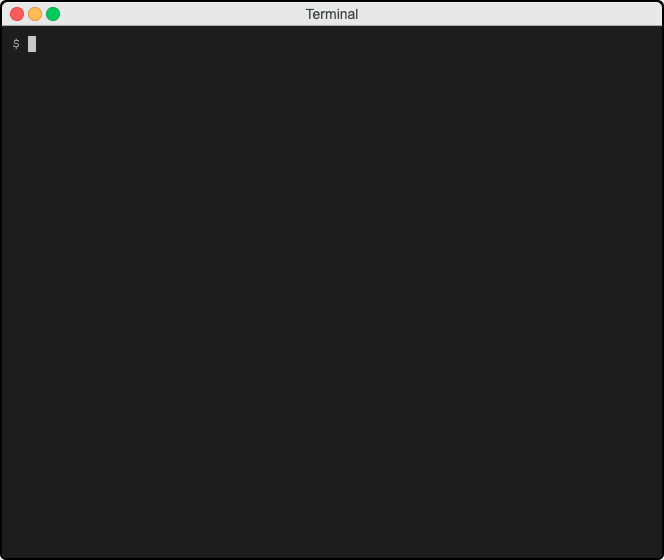

AV-raspi-config - A/V Scene Automation
========================================

### Atem Mini, bitfocus.io Companion, Sound Effects, Background Music, and Video Playout

Automate the deployment of a raspberry PI4 running software configured to automate the ATEM mini switching, video playout, music and sound effects.  

## Prerequisites

#### Required

* Raspberry Pi4 with 4GB or 8GB of RAM
* [32-bit Raspian Lite](https://downloads.raspberrypi.org/raspios_lite_armhf_latest) [installed](https://www.raspberrypi.org/documentation/installation/installing-images/README.md).
  * Desktop and Full versions work, but Raspian LITE is preferred. ( haven't tested 64 bit yet )
* Raspberry Pi4 connected to your network with access to the internet

#### Optional

* HDMI port connected from the PI4 to HDMI input #4 on the ATEM mini
* 3.5mm stereo cable connected from the PI4 to Aux input #1 on the ATEM mini

## Installing

Run the following three commands on your raspberry PI4 and follow prompts.
 
```console

sudo apt-get -y install ansible

curl -O https://raw.githubusercontent.com/robinmordasiewicz/AV-raspi-config/master/raspi-config.yml

ansible-playbook raspi-config.yml


```



## Contents

* [Bitfocus.io Companion](https://bitfocus.io/) - [Companion Facebook group](https://www.facebook.com/groups/2047850215433318/)
* omxplayer
* omxd
* imagemagick
* mpd
* mpc

## License

This project requires no license.

## Acknowledgments

* Hat tip to anyone whose code was used
* Yourname Here

https://robinmordasiewicz.github.io/AV-raspi-config/

<script src="https://utteranc.es/client.js" repo="robinmordasiewicz/AV-raspi-config" issue-term="pathname" theme="github-light" crossorigin="anonymous" async></script>
